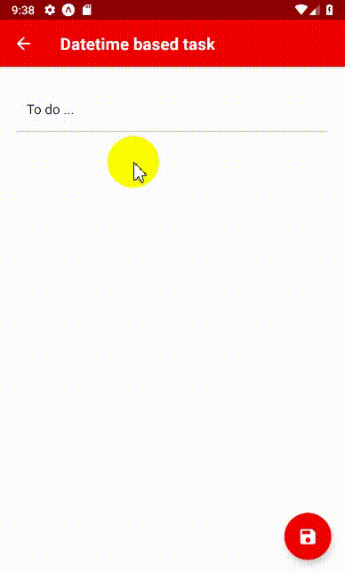

# React Native Chips

Build on top of [react-native-chips](https://github.com/ramprasath25/react-native-chips). This react component gives you the option to mark a `chip` as done by tapping on it and remove it from the list by tapping again. This version depends on [react-native-paper](https://github.com/callstack/react-native-paper) for styling the input.

## Getting Started

```bash
yarn add bojko108/react-native-chips
```

## Usage

```js
import ReactChipsInput from 'react-native-chips';

this.setState({
  toDoList: [
    {
      text: 'Potatoеs',
      finished: false
    },
    {
      text: 'Milk',
      finished: false
    },
    {
      text: 'Cheese',
      finished: false
    }
  ]
});

<ReactChipsInput
  label="To do ..."
  theme={theme}
  chipsStyle={{ flexDirection: 'column', flexWrap: 'wrap', alignItems: 'flex-start' }}
  labelStyle={{ backgroundColor: 'white' }}
  initialChips={this.state.toDoList}
  onChangeChips={chips => this.setState({ toDoList: chips })}
/>;
```

## Properties

| name          | description                                   | type         | default           |
| :------------ | :-------------------------------------------- | :----------- | :---------------- |
| label         | Placeholder for the Text input                | String       | 'Enter your text' |
| initialChips  | Initial Chips to be present                   | Array        | []                |
| onChangeChips | To get the value of chips in array            | Function     | -                 |
| alertRequired | To trigger alert on adding and removing chips | Boolean      | false             |
| chipStyle     | Changing the style of chip elements           | Style Object | {}                |
| **labelStyle**   | Changing the style of the label elements           | Style Object | {}
| **chipsStyle**   | Changing the style of the chips container elements | Style Object | { flexDirection: 'row', flexWrap: 'wrap', alignItems: 'center' }
| **blurOnSubmit** | Blurs the text field when submitted. Set to `true` if you don't want to hide the keyboard while submitting values | Boolean | false
| **theme**        | Theme for the text input element                   | Style Object | {}

## Sample



## Contributing

Pull requests are welcome. For major changes, please open an issue first to discuss what you would like to change.

Please make sure to update tests as appropriate.

## License

react-native-chips is [MIT](LICENSE) License @ Ramprasath R
